# Digimon Adventure RPG Prototype

A private prototype of a **3D mobile monster-taming RPG** built with **Godot 4
(GDScript)**. You create a chibi Tamer, choose a partner Digimon, explore a
digital world, talk to NPCs, take on quests, battle and befriend wild Digimon,
level up, evolve, manage your party, and save your progress.

The game is designed **touch-first, landscape-only** for Android (iOS
secondary), with full keyboard/mouse controls for testing on PC.

> **Assets:** Digimon use free CC0 monster models by Quaternius; everything
> else (characters, world, sounds, music) is an **original placeholder**
> (procedural geometry and synthesized audio). No official Digimon assets are
> included or required. Fonts are SIL OFL
> (Fredoka, Nunito). See [Asset replacement](#asset-replacement).

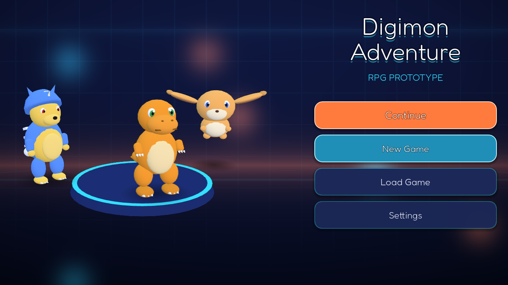

| Character creation | Starter selection |
|---|---|
| 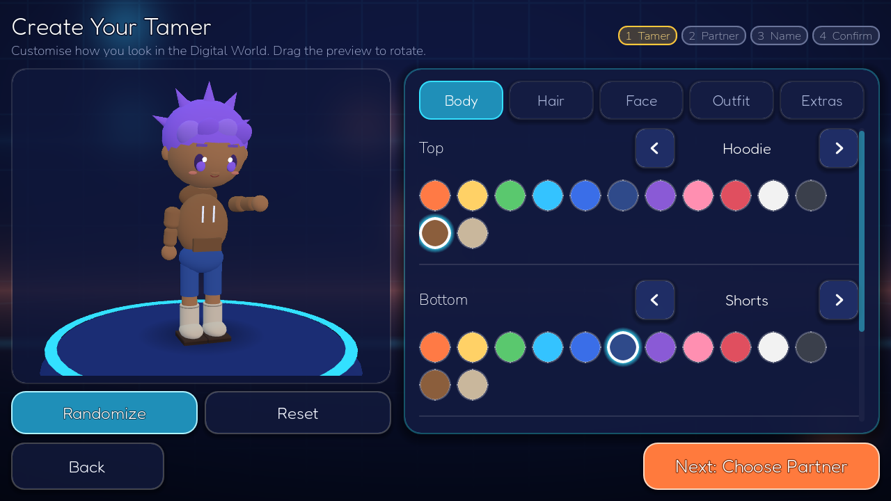 | 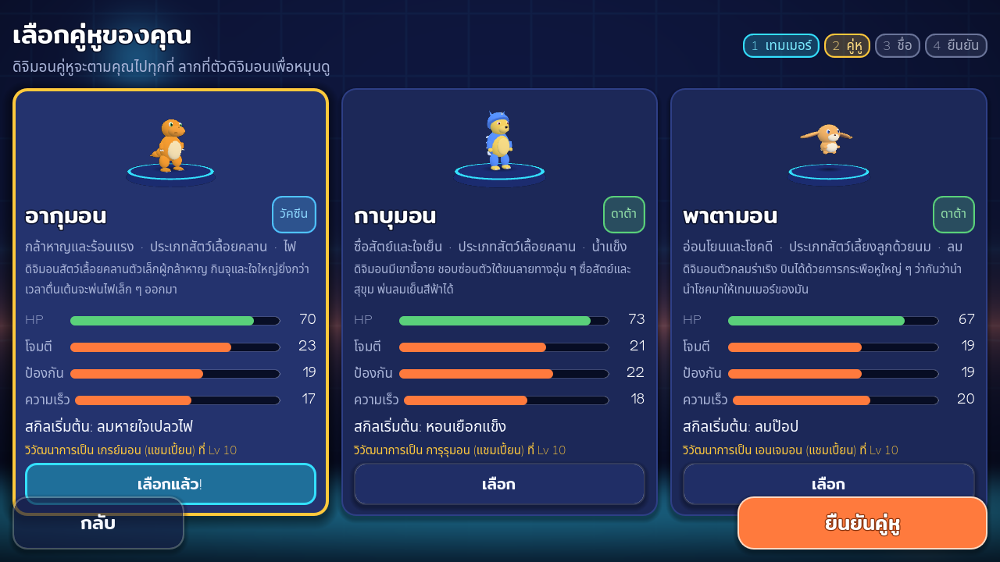 |
| **Exploring the Starter Zone** | **Real-time fight with the skill bar** |
| 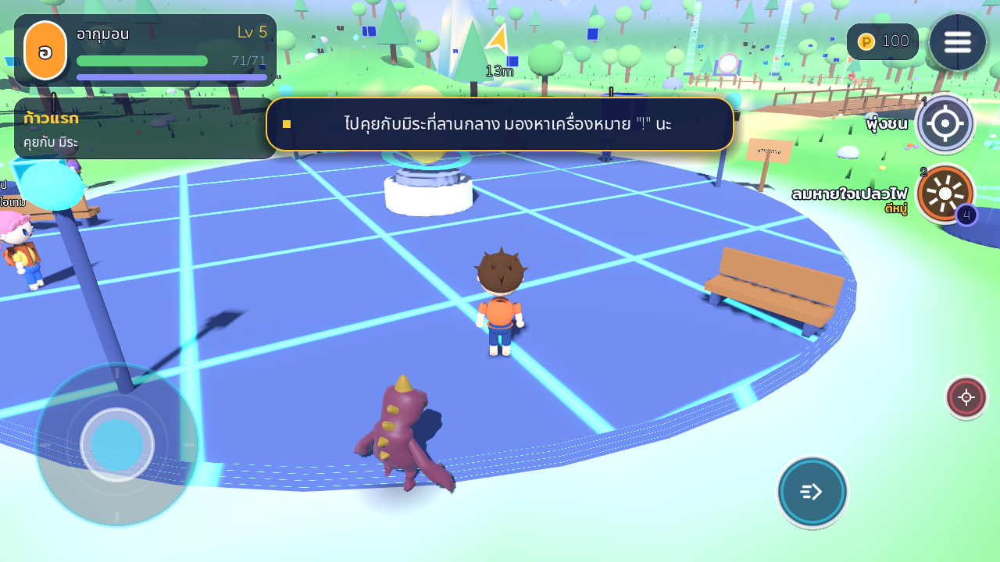 | 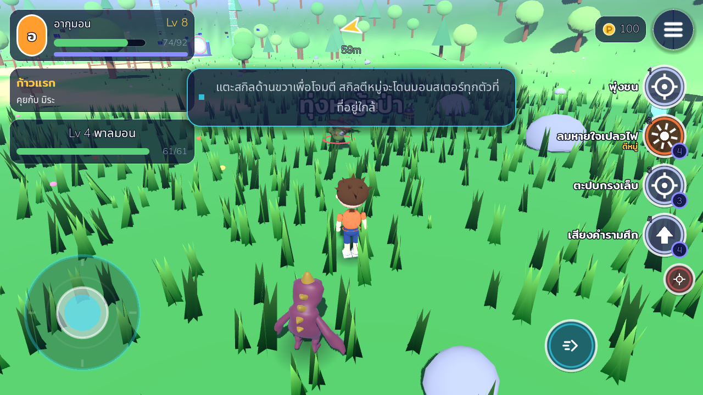 |
| **Area skill hitting a pack** | **Monsters fight back** |
| 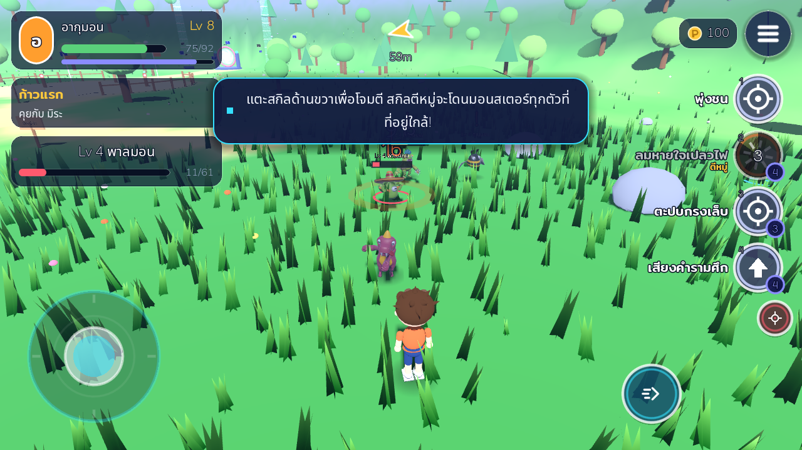 | 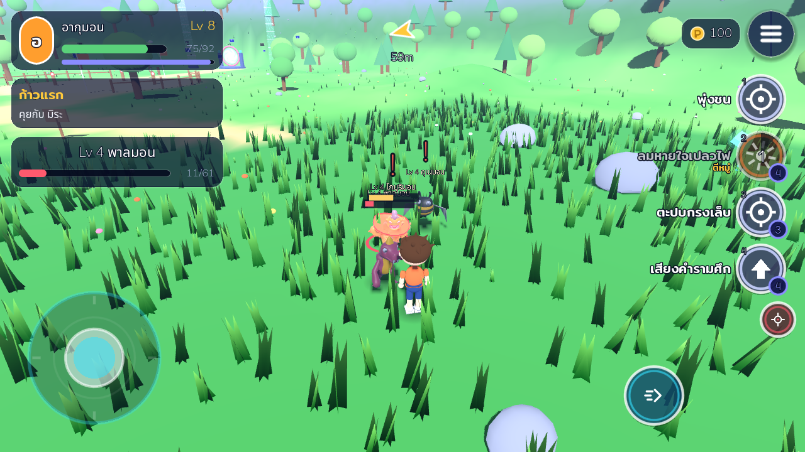 |
| **Data Forest (zone 2)** | **Crystal Lake** |
| 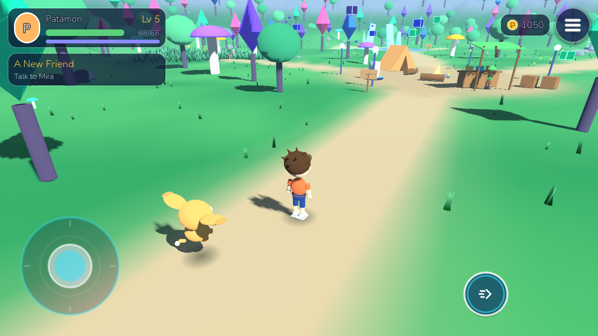 | 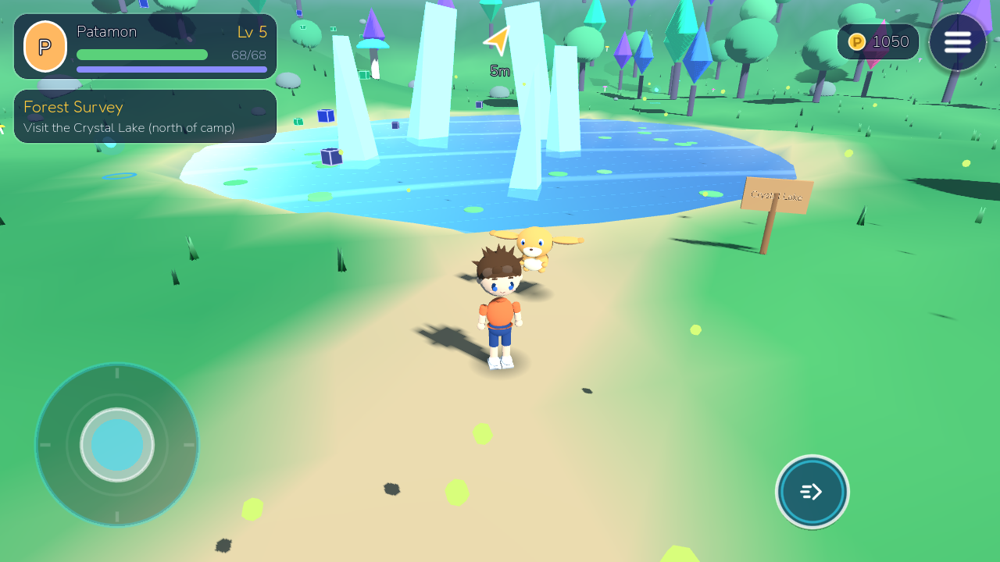 |
| **Shop** | **Equipment chips** |
| 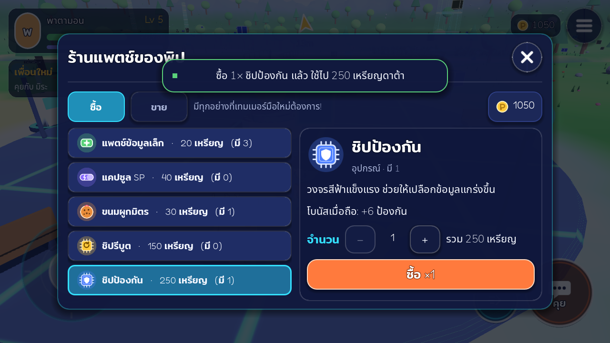 | 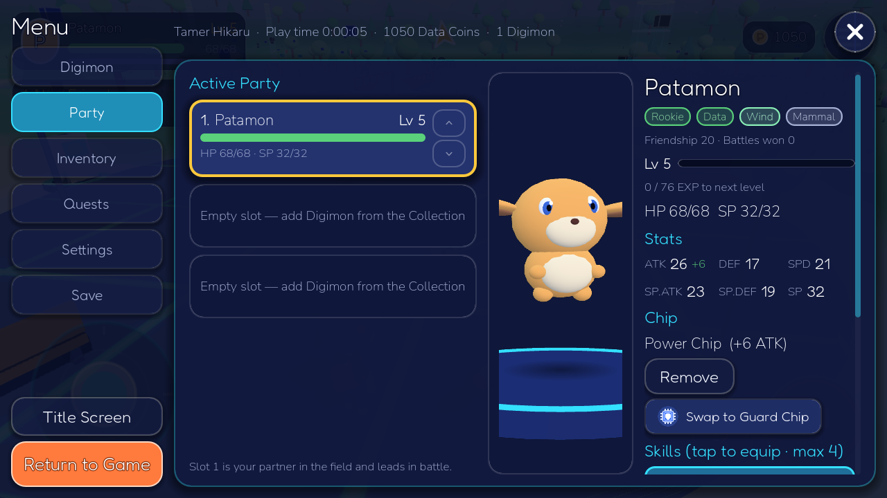 |

---

## Godot version

* **Godot 4.3 or newer** (standard build, no .NET needed).
* Validated headless on **Godot 4.3.0** and **Godot 4.6.0**.
* Renderer: **Compatibility (OpenGL ES 3 / WebGL2 class)** on every platform —
  the most widely supported and cheapest renderer for mid-range Android phones.

## How to open the project

1. Install Godot 4.3+ from <https://godotengine.org/download>.
2. Clone this repository.
3. Start Godot → **Import** → select `project.godot` in the repository root →
   **Import & Edit**.
4. Wait for the first asset import to finish.
   *On the very first import Godot may print a few "missing resource" errors
   for fonts/icons, because the UI theme loads before its fonts are imported.
   They disappear once the import completes (reopen the project if in doubt).*

## How to run

* Press **F5** (Run Project). The game starts at `scenes/boot/boot.tscn` →
  Main Menu.
* You can also open `maps/starter_zone/starter_zone.tscn` or
  `scenes/battle/battle_scene.tscn` and press **F6**: both create a quick
  debug game when launched directly.
* Desktop window: 1280×720. Try other aspect ratios (e.g. 1560×720 = 19.5:9,
  1600×720 = 20:9) from *Project Settings → Display → Window* or with
  `--resolution 1600x720`.

### Command line

```bash
# Run the game
godot --path .

# Unit tests (66 tests); exit code = number of failures
godot --headless --path . res://tests/test_runner.tscn

# End-to-end vertical slice test (new game → quest → field fight → save/load →
# shop → equip a chip → gateway to the Data Forest → forest quest → back)
godot --headless --path . res://tests/integration/vertical_slice_test.tscn

# Walk routes with simulated joystick input (bridges, paths)
godot --headless --path . res://tests/integration/traversal_test.tscn

# Field combat (area skills, monsters hitting back, faint swap, wipe)
godot --headless --path . res://tests/integration/field_combat_test.tscn

# Parse/load every script, scene and resource
godot --headless --path . -s res://tools/check_scripts.gd
```

## Languages

The game is fully translated into **Thai (default)** and English; switch in
Settings → Language (ไทย / English). Source strings are English and double as
keys in `i18n/th.po` (gettext). Plain Control text translates automatically;
formatted strings use `L10n.t("Lv %d") % level`; data resources are
translated in memory by `GameData.apply_locale()`. Run
`python3 tools/i18n_extract.py` to list strings still missing a translation.
Thai glyphs come from Noto Sans Thai / Mitr (OFL) as theme font fallbacks.

## Play in a browser (iPhone / Android / PC)

**Online (GitHub Pages):** https://taearoha-web.github.io/Digimon-Game/play/
(repository must be public and Pages set to *Deploy from a branch* →
this branch → `/docs`). On iPhone, open it in Safari → Share →
**Add to Home Screen**, then start the game from the icon to play
fullscreen. The site in `docs/play/` is produced by
`python3 tools/package_web.py --pages docs/play`.

The project exports to the Web (single-threaded Godot 4.3 build, WebGL 2), so it
runs in Safari on iPhone (iOS 16.4+) and in mobile/desktop Chrome without an
app install.

```bash
# one-time: Godot 4.3 export templates (at least web_nothreads_release.zip)
godot --headless --path . --export-release "Web" build/web/index.html
python3 tools/package_web.py      # -> build/web_artifact/ (~10 MB download)
```

`tools/package_web.py` gzips the engine and game data (35 MB -> 10 MB), adds a
touch-friendly loading page (`tools/web/artifact_shell.html`: Play button,
download progress, "rotate to landscape" hint) and inflates the files in the
browser, so any static host works — no special headers or server compression.
Serve `build/web_artifact/` from any static web host. Saves are kept in the
browser (IndexedDB). On iPhone, turn off silent mode to hear audio.


### Mobile (touch)

| Action | Control |
|---|---|
| Move | Circular virtual joystick (left). Push lightly to walk, fully to run |
| Camera | Drag anywhere on the right side of the screen; pinch to zoom |
| Interact / Talk / Pick up | Big round button (bottom right, appears when something is in range) |
| Sprint toggle | Small round button next to Interact |
| Menu | ☰ button (top right). Tap the partner panel → Party, the quest panel → Quests |
| Dialogue | Tap the box or **Next**; **Skip** closes skippable conversations |
| Android back | Opens / closes the pause menu |

Multitouch is supported: you can hold the joystick and use the camera or
buttons with other fingers at the same time.

### PC (testing fallback)

| Action | Keys |
|---|---|
| Move | **WASD** / **Arrow keys** |
| Run | Hold **Shift** (or toggle the Sprint button) |
| Camera | **Right mouse drag**, or left-drag on the right half of the screen; **Q/E** rotate; **mouse wheel** / **+ −** zoom |
| Interact | **F**, **Space** or **Enter** |
| Pause menu | **Esc** or **Tab** |
| Quick menus | **P** Party · **I** Inventory · **J** Quests |
| UI | Mouse click; the joystick also works with the mouse |

## Gameplay (vertical slice)

Launch → Main Menu → **New Game** → create your Tamer (body type, hair, face,
skin, eyes, clothes, colours, accessories; Randomize/Reset) → choose your
partner (**Agumon / Gabumon / Patamon**) → enter your name → confirm (the game
autosaves) → intro → **Digital World – Starter Zone**:

1. Your partner follows you everywhere.
2. Talk to **Mira** (look for the **!**) → quest **First Steps**.
3. Cross the bridge to the **Training Grounds** (the compass arrow guides you).
4. Fight wild Digimon **right in the map**: your partner's skills are on the
   skill bar at the right edge of the screen. Tap a skill and the partner runs
   at the locked-on monster and fires it: **single-target** skills hit one
   monster, **area** skills (marked "Area") hit every monster around the target
   or around the partner. Skills cost SP and have cooldowns; monsters fight
   back (watch for the red flash before a hit) and you can swap partners or
   change the target with the two small buttons under the skill bar.
   Keyboard: `1`–`4` skills, `R` next target.
5. Win → **EXP** and level-ups (new skills), item drops, and sometimes the
   defeated Digimon asks to **join your team**. If every Digimon faints you wake
   up at the Recovery Terminal.
6. Return to Mira → rewards (items, an **Evo Shard**, Gate Pass) → next quest
   **A New Friend** (befriend a Digimon).
7. Byte's side quest **Scattered Data**: find 3 glowing Data Fragments.
8. Heal at the **Recovery Terminal**, manage your **Party** / **Collection**,
   use items, **evolve** (Lv 10, or Lv 7 with an Evo Shard), save/load anytime.
9. Spend Data Coins at **Pip's Patch Stand** in the plaza (buy/sell).
10. Give your Digimon an **equipment chip** (Inventory → *Gear*, or the
    Digimon details) for a permanent stat bonus while held.
11. With the Gate Pass, step through the **Gateway** (north-east) into the
    **Data Forest**: stronger wild Digimon (Lv 6–11), the Crystal Lake, the
    Old Ruins, and **Lumi**'s quest *Forest Survey* and shop. The gateway at
    the forest's south-west corner leads back home.

## Project architecture

```
res://
  assets/        fonts (OFL), SVG icons (items, UI)
  audio/         music/ and sfx/ (synthesized placeholders, looked up by name)
  characters/    player/ (controller, chibi avatar, appearance, catalog), npc/
  data/          .tres data: digimon/, skills/, items/, quests/, dialogue/,
                 npcs/, encounters/, maps/, config/ (starters, type chart,
                 recruitment, customization catalog)
  digimon/       DigimonVisual, placeholder factory, partner follower, wild AI
  maps/          WorldMap base + starter_zone/ (scene + procedural builder)
  resources/     environments
  scenes/        boot/, battle/
  scripts/util/  MeshKit (shared meshes + toon materials)
  shaders/       sky, water, grass, data cubes, grid floor, pillars, portal, UI bg
  systems/       core/ (autoloads), digimon/, skills/, battle/, inventory/,
                 quests/, dialogue/, party/, recruitment/, world/, input/,
                 camera/, animation/, player/
  ui/            theme/, components/, main_menu/, new_game/, hud/, dialogue/,
                 battle/, menus/, popups/
  vfx/           BattleVfx (data-driven effect presets)
  tests/         unit/, integration/, tools/ (screenshot tours)
  tools/         data/theme/scene/audio generators, script checker
```

### Autoloads (only where a global service is justified)

| Autoload | Responsibility |
|---|---|
| `EventBus` | Cross-system signals (quests, toasts, dialogue, battles) |
| `Settings` | User settings (`user://settings.cfg`), applies audio/graphics |
| `GameData` | Read-only registry that discovers every data `.tres` by folder |
| `GameState` | The running save: `PlayerProfile`, `DigimonRoster`, `Inventory`, `QuestLog`, `WorldState` |
| `SaveManager` | Versioned JSON saves, backups, migration, autosave |
| `AudioManager` | Buses (Master/Music/SFX/UI), music crossfade, pooled SFX |
| `SceneManager` | Scene registry, fades, threaded loading, scene params, toasts |
| `QuestManager` | Quest rules driven by EventBus events |

### Key design rules

* **Static data vs. runtime state.** `DigimonSpecies` (resource) is never
  modified; each owned Digimon is a `DigimonInstance` (level, EXP, HP/SP,
  skills, friendship, evolution history). Evolution changes `species_id` only.
* **Logic separated from presentation.** `BattleController` is a pure
  rules engine that returns event lists; `BattleScene`/`BattleUI` play them
  back. All damage comes from `DamageCalculator` (one formula).
* **Data-driven content.** Starters (`StarterRoster`), species, skills
  (effect lists), items (use effects), quests (objective lists), dialogue,
  NPCs, encounter tables, type chart, recruitment formula and the character
  creator catalog are all resources. Add a `.tres` → it appears in game.
* **Animation contract.** Humans: `idle, walk, run, interact, battle_idle,
  attack, hurt, victory`. Digimon: `idle, walk, run, attack, skill, hurt,
  defeat, victory`. Placeholders generate real `Animation` resources for an
  `AnimationPlayer`, so imported models just need matching clip names (and can
  be driven by an AnimationTree).

More detail: [docs/ARCHITECTURE.md](docs/ARCHITECTURE.md).

## Implemented systems

* New game flow (main menu, character creation, starter selection, name,
  confirmation, intro) with a data-driven customization catalog
* Procedural chibi Tamer (male/female body types sharing one system) and 12
  original placeholder Digimon body plans (19 species)
* Two zones connected by gateways: **Starter Zone** (hills, river, bridge,
  plaza, training grounds, tall-grass meadow, forests, digital landmarks) and
  **Data Forest** (crystal trees, glowing mushrooms, Crystal Lake, Old Ruins,
  Ranger Camp, groves, fireflies) — both procedural via `ZoneBuilderBase`
* Touch joystick, camera drag/pinch, multitouch buttons, keyboard/mouse
* Third-person spring-arm camera with collision; camera-relative movement
* Partner follow AI (NavigationAgent3D, catch-up, teleport, idle fidgets)
* NPCs with quest markers, dialogue system with variables, signposts,
  recovery terminal, pickups, area triggers, portal
* Quest system (Locked/Available/Active/Completed/Rewarded) + tracker, compass
  and quest log; 4 quests
* Shops (data-driven `ShopData`, buy/sell with quantities) and equipment
  chips (one per Digimon, stat bonuses, saved)
* Real-time field combat: skill bar, single / burst / blast skills with
  cooldowns and SP, monsters with HP that hunt your partner, crits, type &
  attribute advantage, buffs/debuffs/status over time, partner swap, rewards
  and recruitment on the spot (`systems/combat/`)
* Turn-based battle scene (speed-based turn order, items, defend, switching,
  escape, befriend) kept for scripted fights such as bosses
  (`WorldMap.start_battle`)
* EXP, level-ups, learnsets, level-up UI; data-driven evolution (level, item,
  friendship, quest, flag, stat requirements) with an evolution cutscene
* Recruitment (in-battle Befriend + post-battle offers), party (max 3),
  Collection/storage, inventory with categories and use effects
* Save/load (3 slots + autosave), versioned + migration, atomic writes,
  backups, corrupt-save protection; autosave on key events
* Settings: music/SFX/UI volume, graphics quality (Low/Medium/High), camera
  sensitivity, invert Y, FPS counter; language-ready
* Audio manager with buses, crossfading music and pooled SFX
* Mobile: landscape (sensor), safe areas, aspect-ratio-safe anchored UI,
  quality levels, MultiMesh scenery, sleeping AI, capped spawns

## Known limitations

* Digimon use CC0 Quaternius models; characters, world and audio are still
  **placeholders** with procedural animation.
* Two explorable zones; further gateways need new `MapData` + scenes.
* Status effects: poison, stun and burn (architecture supports more).
* Not yet tested on physical Android/iOS devices (validated with headless
  Godot, desktop rendering screenshots, and simulated aspect ratios).
* See `PROJECT_STATUS.md` → *Known bugs* for the current list.

## Asset replacement

Everything is swappable without code changes — see
[docs/ASSET_REPLACEMENT.md](docs/ASSET_REPLACEMENT.md):

* **Digimon models:** set `model_path` on a `DigimonSpecies` resource to a
  `.tscn`/`.glb` with an `AnimationPlayer` using the animation contract.
* **Player/NPC models:** replace `ChibiAvatar` with a scene exposing
  `apply_appearance()` / `play_animation()`.
* **Icons:** same file names in `assets/icons/`.
* **Audio:** drop `audio/sfx/<id>.ogg|wav` or `audio/music/<id>.ogg|wav`.

## Development documents

`PROJECT_STATUS.md` (current state), `DEVELOPMENT_PLAN.md` (phases),
`TODO.md`, `CHANGELOG.md`, `ASSET_CREDITS.md`, `docs/`.
